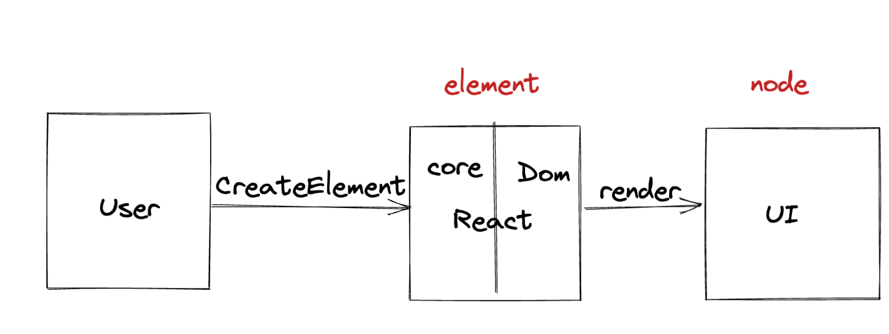
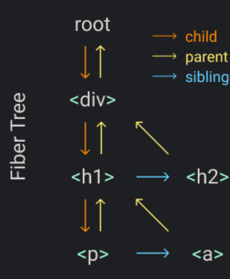
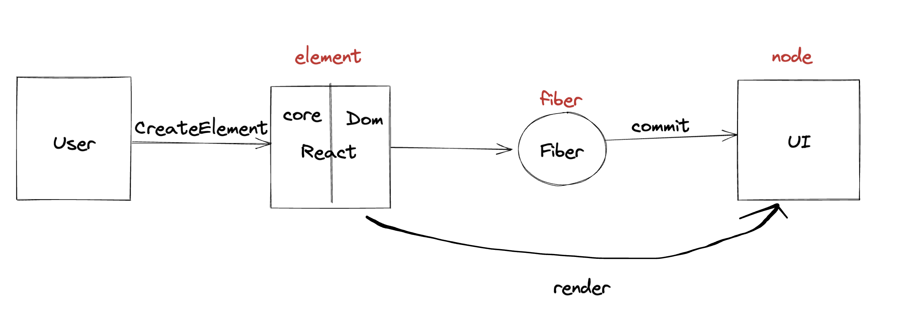
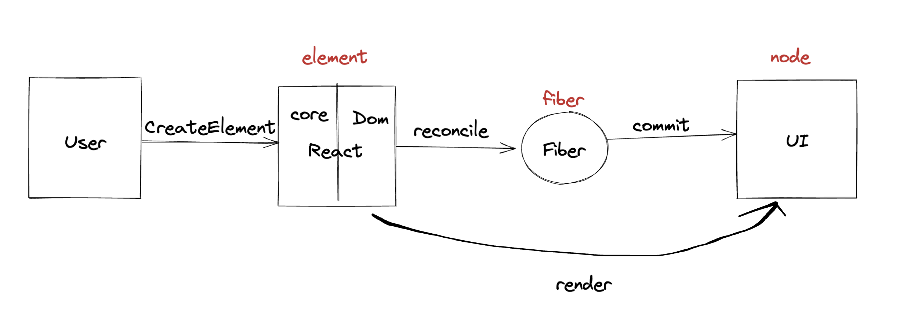

## Step 0：Upper View   

上层调用：

```jsx
const element = <h1 title="foo">Hello</h1>;
const container = document.querySelector("#root");
ReactDom.render(element, container);
```

jsx 编译时转化成：

```js
const element = React.createElement("h1", { title: "foo" }, "Hello");
```

编译时转化我们不用管，babel 去做了


## Step 1：The createElement Function

实现createElement
其实就是返回一个一个 ReactElement:type && props


## Step 2：The render Function
实现render：ReactElement -> DOM node
dfs递归去做

## Step 3: Concurrent Mode
16之前的递归转化Dom node不能中断，一帧可能不够，没时间画页面了

利用 requestIdleCallback，构建一个 workLoop，无限一直循环下去（在浏览器空闲时间），不断去查看 nextUnitOfWork，但凡有东西就去 performUnitOfWork

```js
function workLoop(deadline) {
  let shouldYield = false;
  while (nextUnitOfWork && !shouldYield) {
    nextUnitOfWork = performUnitOfWork(nextUnitOfWork);
    shouldYield = deadline.timeRemaining() < 1;
  }

//   if (!nextUnitOfWork && wipRoot) {
//     commitRoot();
//   }

  requestIdleCallback(workLoop);
}

requestIdleCallback(workLoop);
```

## Step 4: Fibers
#### Fiber: 😈高配版ReactElement😈
从两个角度去看 Fiber
1. 从静态数据结构来看，就是有其他属性的 ReactElement
2. 从动态运行角度来看，他代表着 Step3提到的 a Unit Of Work 
（为什么有了 ReactElement 还需要 Fiber？
答：他需要额外的属性去模拟递归，同时后面很多功能都需要“属性”去实现）


每个任务单元做三件事：
1. ~~add the element to the DOM~~
   ~~将元素添加到 DOM~~
2. create the fibers for the element's children
   为元素的 children 创建 fiber
3. select the next unit of work
   选择下一个工作单元



## Step 5: Render and Commit
为了不要生成一点就添加一点 Dom node，删除上面每个任务单元中的第一件事，然后添加一个 commit 阶段，统一添加真实Dom


我们生成的 Fiber 树 wipRoot(work in progress root)，在 commit 阶段，会转化成 Dom 树


## Step 6: Reconciliation
为了 diff，多了一个 currentRoot，和工作中的 wipRppt去reconcile，在生成每一个 fiber 节点的时候，去对比，是 crud 中的啥操作



#### newFiber = fn(oldFiber,newElement)


## Step 7: Function Components
```jsx
function App(props) {
  return <h1>Hi {props.name}</h1>
}
const element = <App name="foo" />
const container = document.getElementById("root")
Didact.render(element, container)

⬇️
⬇️
⬇️

function App(props) {
  return Didact.createElement(
    "h1",
    null,
    "Hi ",
    props.name
  )
}
const element = Didact.createElement(App, {
  name: "foo",
})
```
一个组件函数也是一个 fiber！！！！
他的 type 就是函数名
1. 他没有 dom 这个属性
2. 他的 children 不能直接从 props 中拿到，得有人去调用type 函数拿到 children


## Step 8: Hooks

每一个组件函数都是一个 fiber，组件的 fiber 有一个 hooks 数组，维护所有的 hooks，给一个例子：

```jsx
function ComplexComponent() {
  const [count, setCount] = useState(0);                    // hook[0]
  const [user, setUser] = useState({ name: '张三' });      // hook[1]
  
  const userRef = useRef(null);                            // hook[2]
  
  const handleClick = useCallback(() => {                   // hook[3]
    setCount(c => c + 1);
  }, []);
  
  useEffect(() => {                                        // hook[4]
    console.log('count changed:', count);
  }, [count]);
  
  const memoizedValue = useMemo(() => {                    // hook[5]
    return count * 2;
  }, [count]);

  return <div>...</div>;
}
```
hooks的存储如下：
```js
fiber.hooks = [
  {
    // useState hook for count
    state: 0,
    queue: [] // 状态更新队列
  },
  {
    // useState hook for user
    state: { name: '张三' },
    queue: []
  },
  {
    // useRef hook
    memoizedState: {
      current: null
    }
  },
  {
    // useCallback hook
    memoizedState: {
      callback: () => { setCount(c => c + 1) },
      deps: [] // 空依赖数组
    }
  },
  {
    // useEffect hook
    effect: {
      create: () => { 
        console.log('count changed:', count);
        return () => { /* cleanup */ };
      },
      deps: [0], // count的当前值
      destroy: undefined // 清理函数
    }
  },
  {
    // useMemo hook
    memoizedState: {
      value: 0, // 计算结果
      deps: [0] // count的当前值
    }
  }
];

```
